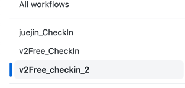
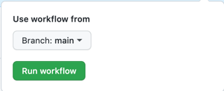

## 定时任务脚本

执行结束发送邮件通知签到结果。

使用方法：fork 本仓库

打开浏览器，登陆对应网站，F12 查看 Network 面板，复制 cookie

打开 github 仓库的 Setting，选择 Secrets，新建下列 4 个仓库 Secret

| key | value |
| --- | ---|
| 网站名称_COOKIE | 值为复制的 cookie |
| USER | 发送邮件的邮箱地址，该邮箱需要开启 SMTP |
| PASS | 该邮箱的 SMTP 密码 |
| TO | 接收邮件的邮箱 |

> 注：网站名称_COOKIE
> 
> 例子：掘金的为JUEJIN_COOKIE

之后进入Actions中，找到对应的名称的脚本文件

点击按钮
Run workflow

选择一个分支，然后点击绿色按钮`Run workflow`直接执行就OK了

